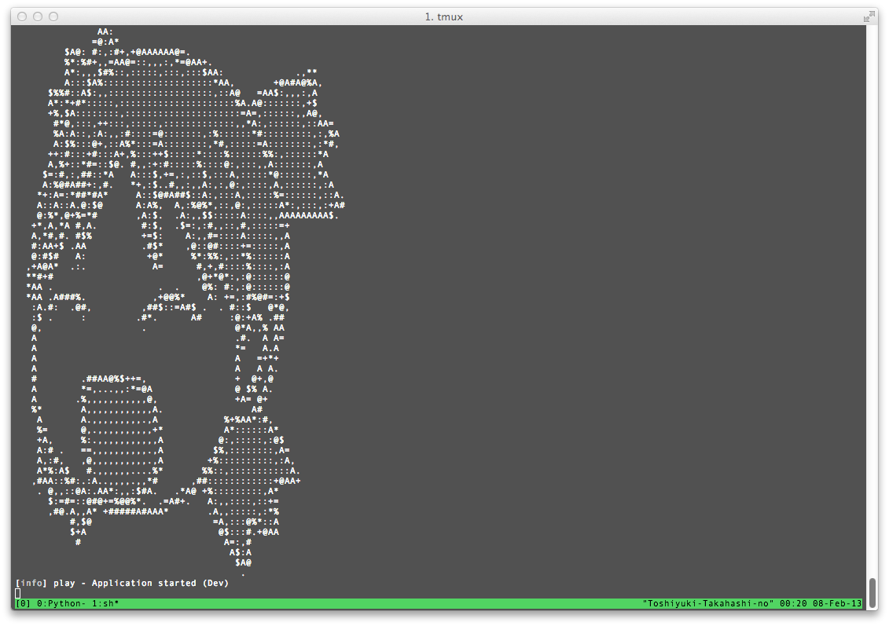

# play2-ascii-art-module

The original idea is from https://github.com/cb372/scala-ascii-art



## Configuration

play.plugins
```
1000:com.github.tototoshi.aa.AAPlugin
```

conf/application.conf
```
aa.image.onstart=conf/yotuba1.jpg
aa.image.onstop=conf/yotuba2.jpg
aa.image.width=60
```


